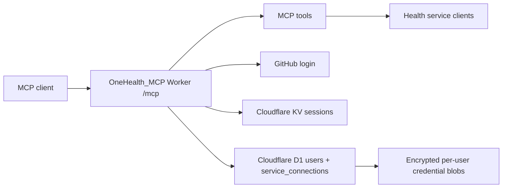

# OneHealth_MCP

OneHealth_MCP is a production-ready remote [Model Context Protocol](https://modelcontextprotocol.io/) server for personal health, fitness, training, nutrition, and wearable data.

It exposes one `/mcp` endpoint while each signed-in user connects their own services from `/connections`.

## Integrations

- **Hevy**: workouts, routines, exercise templates, routine folders, workout events
- **Strava**: athlete profile, recent activities, segment starring
- **Cronometer**: diary, nutrition, food search, custom foods, fasting, macro targets
- **Intervals.icu**: athlete profile, activities, wellness, events, gear, sport settings
- **Fitbit**: profile, activity summaries, sleep, body weight, heart rate
- **Google Fit**: data sources, activity aggregates, body aggregates, heart aggregates, sleep aggregates

## Architecture



## Security Model

- No real API keys or tokens are committed.
- GitHub identifies the user.
- Cloudflare KV stores OAuth/session state.
- Cloudflare D1 stores users and service connection metadata.
- Service credentials are AES-GCM encrypted before being stored in D1.
- Each user manages credentials from `/connections`.
- Existing FitnessMCP Cloudflare resources are not reused. Create new KV and D1 resources for this project.

## Beginner Setup

### 1. Install tools

Install:

- Node.js
- Git
- A Cloudflare account
- A GitHub account

Check:

```bash
node --version
git --version
```

### 2. Clone

```bash
git clone https://github.com/senoj100-alt/OneHealth_MCP.git
cd OneHealth_MCP
npm install
```

### 3. Log in to Cloudflare

```bash
npx wrangler login
```

### 4. Create new Cloudflare resources

Do not use existing FitnessMCP resources.

Create a new KV namespace:

```bash
npx wrangler kv namespace create OAUTH_KV
```

Create a new D1 database:

```bash
npx wrangler d1 create onehealth_mcp
```

Put the returned IDs into `wrangler.jsonc`:

```txt
REPLACE_WITH_YOUR_PRODUCTION_KV_NAMESPACE_ID
REPLACE_WITH_YOUR_PRODUCTION_D1_DATABASE_ID
```

For dev, either reuse those IDs or create dev-only resources:

```bash
npx wrangler kv namespace create OAUTH_KV --env dev
npx wrangler d1 create onehealth_mcp_dev
```

### 5. Apply the D1 schema

```bash
npx wrangler d1 migrations apply onehealth_mcp
```

For dev:

```bash
npx wrangler d1 migrations apply onehealth_mcp_dev --env dev
```

### 6. Create a GitHub OAuth app

For local development:

```txt
Application name: OneHealth_MCP Local
Homepage URL: http://localhost:8787
Authorization callback URL: http://localhost:8787/callback
```

For production, create a second OAuth app:

```txt
Application name: OneHealth_MCP
Homepage URL: https://onehealth-mcp.YOUR_SUBDOMAIN.workers.dev
Authorization callback URL: https://onehealth-mcp.YOUR_SUBDOMAIN.workers.dev/callback
```

### 7. Configure local secrets

```bash
cp .dev.vars.example .dev.vars
openssl rand -hex 32
```

Fill in:

```txt
GITHUB_CLIENT_ID=...
GITHUB_CLIENT_SECRET=...
COOKIE_ENCRYPTION_KEY=...
```

Optional OAuth app credentials for provider connect buttons:

```txt
FITBIT_CLIENT_ID=...
FITBIT_CLIENT_SECRET=...
GOOGLE_FIT_CLIENT_ID=...
GOOGLE_FIT_CLIENT_SECRET=...
```

Users can also paste service credentials manually in `/connections`.

### 8. Run locally

```bash
npm run dev
```

Open:

```txt
http://localhost:8787
http://localhost:8787/connections
http://localhost:8787/health
```

### 9. Set production secrets

Run only for the new `onehealth-mcp` Worker:

```bash
npx wrangler secret put GITHUB_CLIENT_ID
npx wrangler secret put GITHUB_CLIENT_SECRET
npx wrangler secret put COOKIE_ENCRYPTION_KEY
npx wrangler secret put FITBIT_CLIENT_ID
npx wrangler secret put FITBIT_CLIENT_SECRET
npx wrangler secret put GOOGLE_FIT_CLIENT_ID
npx wrangler secret put GOOGLE_FIT_CLIENT_SECRET
```

### 10. Deploy

```bash
npm run deploy
```

Your MCP endpoint will be:

```txt
https://onehealth-mcp.YOUR_SUBDOMAIN.workers.dev/mcp
```

## MCP Client Config

```json
{
  "mcpServers": {
    "onehealth-mcp": {
      "command": "npx",
      "args": [
        "mcp-remote",
        "https://onehealth-mcp.YOUR_SUBDOMAIN.workers.dev/mcp"
      ]
    }
  }
}
```

## Tool Examples

```txt
fitness_get_connected_services
fitbit_get_profile
fitbit_get_activity_summary
fitbit_get_sleep
fitbit_get_body_weight
fitbit_get_heart_rate
google_fit_list_data_sources
google_fit_get_activity_summary
google_fit_get_body_summary
google_fit_get_heart_summary
google_fit_get_sleep_summary
strava_get_recent_activities
cronometer_get_daily_nutrition
intervals_get_wellness
get_workouts
```

## Development

```bash
npm run dev
npm run type-check
npm run test:run
npm run lint
npm run check
```

## Project Structure

```txt
src/
  mcp-agent.ts
  github-handler.ts
  lib/
    service-connections.ts
    service-registry.ts
    fitbit-client.ts
    google-fit-client.ts
    strava-client.ts
    cronometer-client.ts
    intervals-client.ts
migrations/
  0001_service_connections.sql
wrangler.jsonc
.dev.vars.example
```

## Production Checklist

- New Cloudflare Worker name: `onehealth-mcp`
- New KV namespace for OneHealth_MCP
- New D1 database for OneHealth_MCP
- D1 migration applied
- GitHub OAuth app callback points to this Worker
- Fitbit and Google OAuth app callbacks point to `/connect/fitbit/callback` and `/connect/google_fit/callback`
- `/connections` works for the signed-in user
- `npm run check` passes
- No `.dev.vars`, `.env`, tokens, passwords, or IDs committed

## License

MIT
